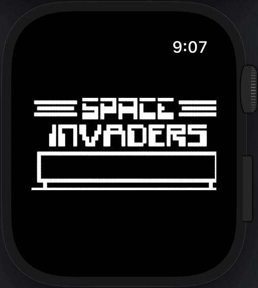

# README
A Chip-8 emulator for watchOS written in Swift.

## Architecture
The core Chip-8 emulator functionality is implemented in [this Swift pacakge](https://github.com/ryanggrey/Chip8EmulatorPackage) which this project uses as a dependency. 

Core Chip-8 emulator functionality is not handled by this project. This project concerns itself with:
- How to select and load ROMs into the Chip-8 emulator
- How to run the Chip-8 emulator.
- How to render the resulting Chip-8 emulator `pixels`.
- How to collect and map user input to the Chip-8 emulator.

## Assets
### ROMs
The ROMs bundled into this project are from https://github.com/dmatlack/chip8
